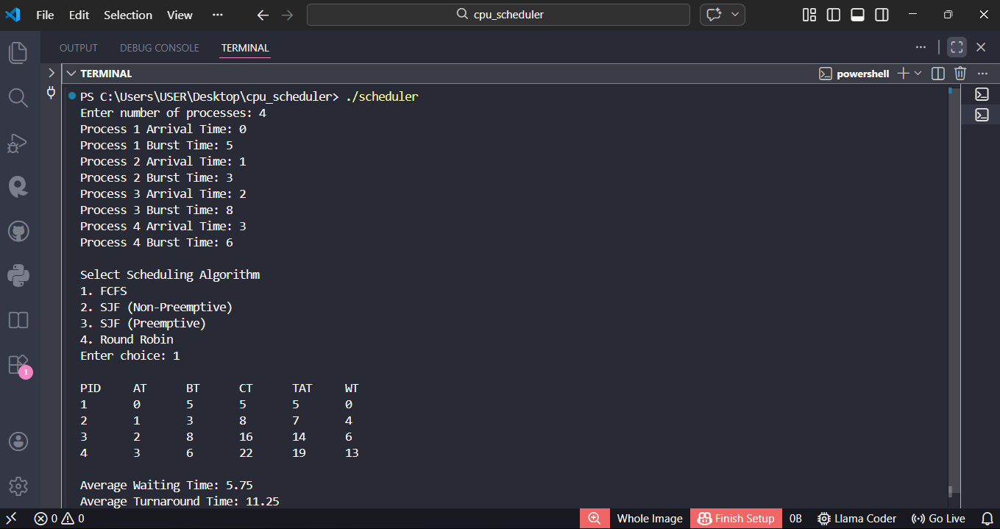
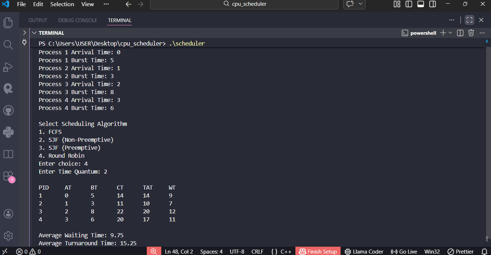
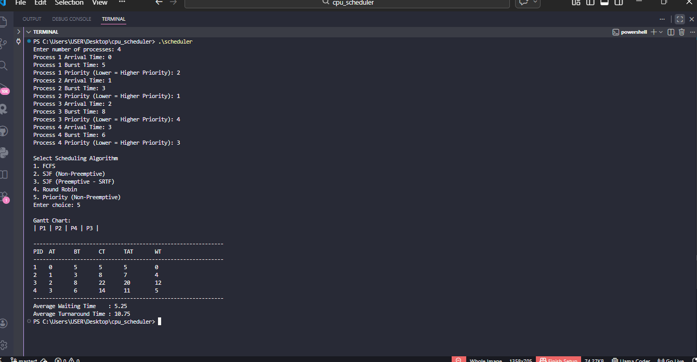

# 🧠 CPU Scheduling Simulator (C++)

A console-based CPU Scheduling Simulator implementing core Operating System scheduling algorithms with Gantt Chart visualization and performance metrics.

Built as a core Operating Systems systems-level project to understand real-world CPU scheduling behavior.

---

## 🚀 Overview

This project simulates how an Operating System schedules processes using different CPU scheduling algorithms.

It calculates:
- Completion Time (CT)
- Turnaround Time (TAT)
- Waiting Time (WT)
- Average Waiting Time
- Average Turnaround Time
- Gantt Chart Execution Order

---

## 🧮 Algorithms Implemented

✔ First Come First Serve (FCFS)  
✔ Shortest Job First (SJF - Non Preemptive)  
✔ Round Robin (Preemptive)  
✔ Priority Scheduling (Non-Preemptive)

---

## 📊 Features

- Modular Code Structure (Header + Source separation)
- Gantt Chart Visualization
- Multi-algorithm comparison
- Time Quantum support (Round Robin)
- Priority Scheduling support
- Clean console output
- Accurate scheduling metrics

---

## 🏗 Project Structure

cpu-scheduling-simulator/
│
├── main.cpp
├── scheduler.cpp
├── scheduler.h
├── process.h
├── assets/
│   ├── fcfs_output.png
│   ├── rr_output.png
│   └── priority_scheduling_output.png
└── README.md

---

## 🖥 Sample Output

### 🔹 FCFS Output

---

### 🔹 Round Robin Output (TQ = 2)

---

### 🔹 Priority Scheduling Output (Non-Preemptive)

---

## 🛠 Technologies Used

- C++
- STL (vector, algorithm, queue)
- Modular Programming
- Operating System Concepts

---

## ▶ How to Compile and Run

### 🔹 Windows (MinGW)

g++ main.cpp scheduler.cpp -o scheduler
scheduler

### 🔹 Linux / WSL

g++ main.cpp scheduler.cpp -o scheduler
./scheduler

📚 Concepts Covered

CPU Scheduling Algorithms

Preemptive vs Non-Preemptive Scheduling

Priority Scheduling Logic

Process Lifecycle

Context Switching Logic

OS Performance Metrics

🎯 Learning Outcomes

Understanding of CPU scheduling trade-offs

Implementation of preemptive & non-preemptive algorithms

Implementation of Priority Scheduling

Calculation of OS performance metrics

Structured modular C++ programming

👨‍💻 Author

Rohit Khokhar
B.Tech CSE